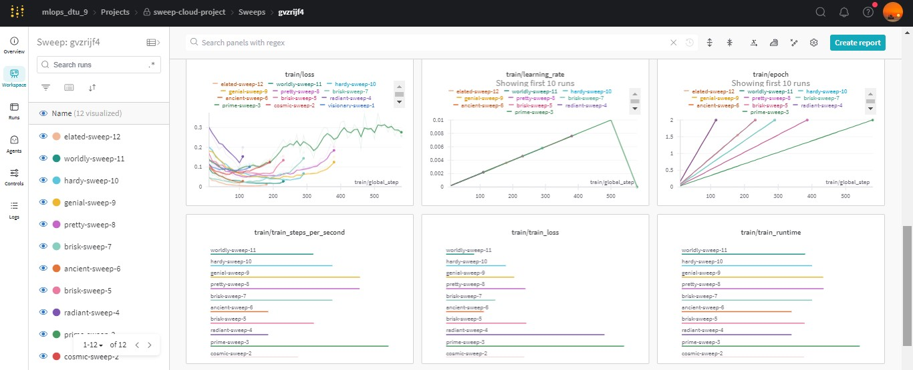
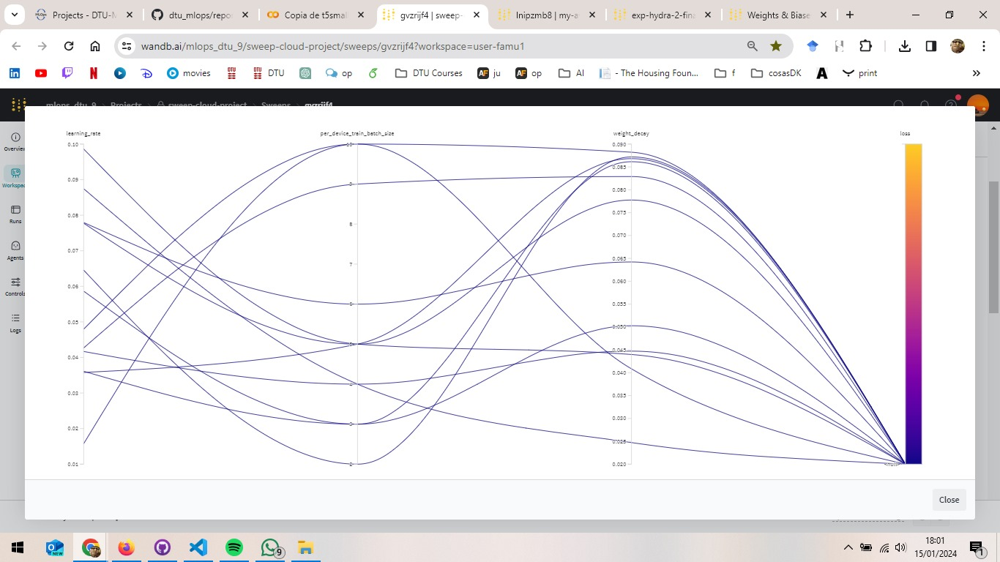
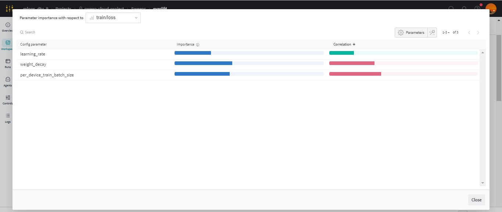
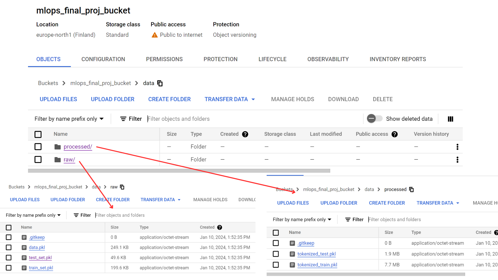
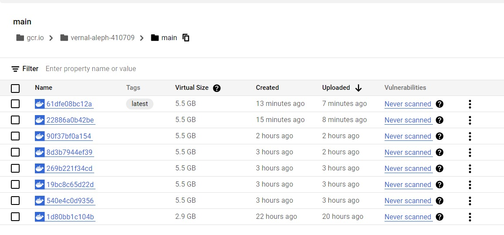
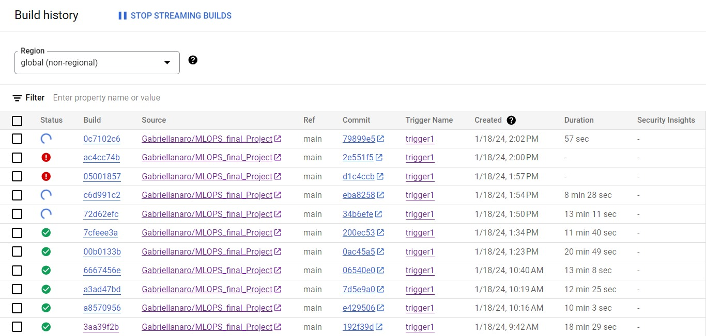

# Exam template for 02476 Machine Learning Operations

This is the report template for the exam. Please only remove the text formatted as with three dashes in front and behind
like:

```--- question 1 fill here ---```

where you instead should add your answers. Any other changes may have unwanted consequences when your report is auto
generated in the end of the course. For questions where you are asked to include images, start by adding the image to
the `figures` subfolder (please only use `.png`, `.jpg` or `.jpeg`) and then add the following code in your answer:

```markdown

```

In addition to this markdown file, we also provide the `report.py` script that provides two utility functions:

Running:

```bash
python report.py html
```

will generate an `.html` page of your report. After deadline for answering this template, we will autoscrape
everything in this `reports` folder and then use this utility to generate an `.html` page that will be your serve
as your final handin.

Running

```bash
python report.py check
```

will check your answers in this template against the constrains listed for each question e.g. is your answer too
short, too long, have you included an image when asked to.

For both functions to work it is important that you do not rename anything. The script have two dependencies that can
be installed with `pip install click markdown`.

## Overall project checklist

The checklist is *exhaustic* which means that it includes everything that you could possible do on the project in
relation the curricilum in this course. Therefore, we do not expect at all that you have checked of all boxes at the
end of the project.

### Week 1

* [X] Create a git repository
* [X] Make sure that all team members have write access to the GitHub repository
* [X] Create a dedicated environment for your project to keep track of your packages
* [X] Create the initial file structure using cookiecutter
* [X] Fill out the `make_dataset.py` file such that it downloads whatever data you need and
* [X] Add a model file and a training script and get that running
* [X] Remember to fill out the `requirements.txt` file with whatever dependencies that you are using
* [ ] Remember to comply with good coding practices (`pep8`) while doing the project
* [ ] Do a bit of code typing and remember to document essential parts of your code
* [X] Setup version control for your data or part of your data
* [X] Construct one or multiple docker files for your code
* [X] Build the docker files locally and make sure they work as intended
* [X] Write one or multiple configuration files for your experiments
* [X] Used Hydra to load the configurations and manage your hyperparameters
* [ ] When you have something that works somewhat, remember at some point to do some profiling and see if
      you can optimize your code
* [X] Use Weights & Biases to log training progress and other important metrics/artifacts in your code. Additionally,
      consider running a hyperparameter optimization sweep.
* [ ] Use Pytorch-lightning (if applicable) to reduce the amount of boilerplate in your code

### Week 2

* [X] Write unit tests related to the data part of your code
* [X] Write unit tests related to model construction and or model training
* [ ] Calculate the coverage.
* [X] Get some continuous integration running on the github repository
* [X] Create a data storage in GCP Bucket for you data and preferable link this with your data version control setup
* [ ] Create a trigger workflow for automatically building your docker images
* [X] Get your model training in GCP using either the Engine or Vertex AI
* [X] Create a FastAPI application that can do inference using your model
* [ ] If applicable, consider deploying the model locally using torchserve
* [X] Deploy your model in GCP using either Functions or Run as the backend

### Week 3

* [X] Check how robust your model is towards data drifting
* [X] Setup monitoring for the system telemetry of your deployed model
* [X] Setup monitoring for the performance of your deployed model
* [ ] If applicable, play around with distributed data loading
* [ ] If applicable, play around with distributed model training
* [ ] Play around with quantization, compilation and pruning for you trained models to increase inference speed

### Additional

* [X] Revisit your initial project description. Did the project turn out as you wanted?
* [X] Make sure all group members have a understanding about all parts of the project
* [X] Uploaded all your code to github

## Group information

### Question 1
> **Enter the group number you signed up on <learn.inside.dtu.dk>**
>
> Answer:

--- Group 9 ---

### Question 2
> **Enter the study number for each member in the group**
>
> Example:
>
> *sXXXXXX, sXXXXXX, sXXXXXX*
>
> Answer:

--- s233541, s233124, s233132, s212246, s233144 ---

### Question 3
> **What framework did you choose to work with and did it help you complete the project?**
>
> Answer length: 100-200 words.
>
> Example:
> *We used the third-party framework ... in our project. We used functionality ... and functionality ... from the*
> *package to do ... and ... in our project*.
>
> Answer:

--- As our `main` framework we have used Transformers from Pytorch, which is a library of state-of-the-art pre-trained models for Natural Language Processing (NLP). ---

## Coding environment

> In the following section we are interested in learning more about you local development environment.

### Question 4

> **Explain how you managed dependencies in your project? Explain the process a new team member would have to go**
> **through to get an exact copy of your environment.**
>
> Answer length: 100-200 words
>
> Example:
> *We used ... for managing our dependencies. The list of dependencies was auto-generated using ... . To get a*
> *complete copy of our development environment, one would have to run the following commands*
>
> Answer:

--- We used conda/pip for managing our dependencies. The list of dependencies could be found in the `requirements.txt` file. This allow the user to get a complete copy of our environment. One would
have to run the following commands:
1. `git clone https://github.com/Gabriellanaro/MLOPS_final_Project`
2. Navigate to project directory
3. Create a virtual environment: `conda create --name <nameOfTheEnv>`
4. Activate the virtual environment: `conda activate <nameOfTheEnv>`
5. Run: `pip install -r requirements.txt`    ---

### Question 5

> **We expect that you initialized your project using the cookiecutter template. Explain the overall structure of your**
> **code. Did you fill out every folder or only a subset?**
>
> Answer length: 100-200 words
>
> Example:
> *From the cookiecutter template we have filled out the ... , ... and ... folder. We have removed the ... folder*
> *because we did not use any ... in our project. We have added an ... folder that contains ... for running our*
> *experiments.*
> Answer:

--- Within our project's cookiecutter template, several folders cater to specific functionalities:
1. Src folder: This directory encompasses data, models, and visualization subfolders. We've exclusively engaged the data subfolder for data retrieval scripts, and the models subfolder houses implementations for modeling, training, and prediction scripts.
2. Test folder: This section houses scripts dedicated to executing tests, ensuring robustness and accuracy.
3. Reports: This directory contains the outcomes of analyses in HTML format, alongside figures and graphics generated during the project's exploration and analysis phase.
4. Docker: Essential for Docker-related files and configurations, this folder is integral for deployment and containerization.

However, the notebooks folder, designated for Jupyter Notebook usage, and the docs folder, designated for documentation purposes, are unnecessary for our current project objectives. Removing these folders streamlines our project structure without impacting functionality. ---

### Question 6

> **Did you implement any rules for code quality and format? Additionally, explain with your own words why these**
> **concepts matters in larger projects.**
>
> Answer length: 50-100 words.
>
> Answer:

--- In larger projects, `main`taining code quality and consistent formatting is crucial. It allows for better collaboration as developers can easily understand and follow the code written by others. It also helps in catching potential errors early, reducing the time spent on debugging and increasing the overall efficiency of the development process.---

## Version control

> In the following section we are interested in how version control was used in your project during development to
> corporate and increase the quality of your code.

### Question 7

> **How many tests did you implement and what are they testing in your code?**
>
> Answer length: 50-100 words.
>
> Example:
> *In total we have implemented 2 tests. Primarily we are testing the `make_dataset.py` fila, in this we wanted to test if the `preprocess()` function works correctly. As well, in the second test we basically test our trained model (`train_model.py`).*
>
>
> Answer:

--- In total we have implemented two test. We tested first the `preprocess_function` which is defined in `src/data/make_dataset.py`. The aim is to compare the preprocessed data generated by the `preprocess_function` with the data loaded from the saved pickle files. If the preprocessed data from both sources matches, it indicates that the `preprocess_function` is working correctly and consistently producing the expected results. On the other hand the second test we implemented aims to check if the model works. Do accomplish that we defined a French sentence, tokenizes it using the tokenizer, moves the tokenized inputs to the GPU if available, and generates the translation using the model. The generated translation is not explicitly checked for correctness, but the fact that the function runs without raising an exception indicates that the model was able to process the sentence and generate some output. ---

### Question 8

> **What is the total code coverage (in percentage) of your code? If you code had an code coverage of 100% (or close**
> **to), would you still trust it to be error free? Explain you reasoning.**
>
> Answer length: 100-200 words.
>
> Example:
> *The total code coverage of code is X%, which includes all our source code. We are far from 100% coverage of our **
> *code and even if we were then...*
>
> Answer:

--- So far we coudn't compute the coverage because we ran into an error that we coudn't fix yet. If our coverage had been close to 100%, that wouldn't imply that the code was error-free. This is because it merely measures how many lines of code are run during test execution. ---

### Question 9

> **Did you workflow include using branches and pull requests? If yes, explain how. If not, explain how branches and**
> **pull request can help improve version control.**
>
> Answer length: 100-200 words.
>
> Example:
> *We made use of both branches and PRs in our project. In our group, each member had an branch that they worked on in*
> *addition to the `main` branch. To merge code we ...*
>
> Answer:

--- In our project, we effectively used a common Git workflow that involves branches and Pull Requests (PRs). Each team member was assigned their own branch, separate from the `main` branch. This approach allowed us to work independently without affecting the `main` codebase. When a team member completed a feature or a piece of work, they created a `Pull Request`. It provided an opportunity for the rest of the team to review the changes, suggest modifications, and eventually approve the changes.

Once the PR was approved, the changes were merged into the `main` branch. This workflow ensured that all changes were reviewed and tested before they were incorporated into the `main` codebase, which helped us `main`tain code quality and prevent bugs.  ---

### Question 10

> **Did you use DVC for managing data in your project? If yes, then how did it improve your project to have version**
> **control of your data. If no, explain a case where it would be beneficial to have version control of your data.**
>
> Answer length: 100-200 words.
>
> Example:
> *We did make use of DVC in the following way: ... . In the end it helped us in ... for controlling ... part of our*
> *pipeline*
>
> Answer:

--- We indeed used DVC for managing and versioning our data. DVC greatly improved our project by providing a systematic way to version control our datasets and machine learning models, similar to how Git versions code. We could easily roll back to a previous version of a dataset or model, ensuring we could reproduce earlier stages of our work if needed.This was especially beneficial in a collaborative environment, as it ensured consistency and reproducibility across different stages of the project, regardless of who was working on it or when they were working on it. ---

### Question 11

> **Discuss you continues integration setup. What kind of CI are you running (unittesting, linting, etc.)? Do you test**
> **multiple operating systems, python version etc. Do you make use of caching? Feel free to insert a link to one of**
> **your github actions workflow.**
>
> Answer length: 200-300 words.
>
> Example:
> *We have organized our CI into 3 separate files: one for doing ..., one for running ... testing and one for running*
> *... . In particular for our ..., we used ... .An example of a triggered workflow can be seen here: <weblink>*
>
> Answer:

--- question 11 fill here ---

## Running code and tracking experiments

> In the following section we are interested in learning more about the experimental setup for running your code and
> especially the reproducibility of your experiments.

### Question 12

> **How did you configure experiments? Did you make use of config files? Explain with coding examples of how you would**
> **run a experiment.**
>
> Answer length: 50-100 words.
>
> Example:
> *We used a simple argparser, that worked in the following way: python my_script.py --lr 1e-3 --batch_size 25*
>
> Answer:

--- In our project, we configured experiments dynamically changing and adding hyperparameters on the fly from the command line.
Example: `python train_model.py hp.batch_size=16 hp.epochs=4`

The results of the experiments are written by default in the directory `outputs` ---

### Question 13

> **Reproducibility of experiments are important. Related to the last question, how did you secure that no information**
> **is lost when running experiments and that your experiments are reproducible?**
>
> Answer length: 100-200 words.
>
> Example:
> *We made use of config files. Whenever an experiment is run the following happens: ... . To reproduce an experiment*
> *one would have to do ...*
>
> Answer:

--- question 13 fill here ---

### Question 14

> **Upload 1 to 3 screenshots that show the experiments that you have done in W&B (or another experiment tracking**
> **service of your choice). This may include loss graphs, logged images, hyperparameter sweeps etc. You can take**
> **inspiration from [this figure](figures/wandb.png). Explain what metrics you are tracking and why they are**
> **important.**
>
> Answer length: 200-300 words + 1 to 3 screenshots.
>
> Example:
> *As seen in the first image when have tracked ... and ... which both inform us about ... in our experiments.*
> *As seen in the second image we are also tracking ... and ...*
>
> Answer:

--- Our code sets up a hyperparameter sweep using the Weights & Biases (W&B) library to optimize the training process of t5-small. As it can be seen in  and in  we have made different experiments changing the `learning_rate, batch_size and weight_decay`. As well,  shows which of the parameters has more impact on the model. In summary, this code automates the hyperparameter tuning process, leveraging W&B for experiment tracking and optimization, and utilizes the `Trainer` class for training a transformer-based model with varying hyperparameter configurations.---

### Question 15

> **Docker is an important tool for creating containerized applications. Explain how you used docker in your**
> **experiments? Include how you would run your docker images and include a link to one of your docker files.**
>
> Answer length: 100-200 words.
>
> Example:
> *For our project we developed several images: one for training, inference and deployment. For example to run the*
> *training docker image: `docker run trainer:latest lr=1e-3 batch_size=64`. Link to docker file: <weblink>*
>
> Answer:

--- During our project we developed docker images in order to make the deployment on the cloud. We build te the docker image locally and then we push it to the cloud. Before pushing we test the image locally, when it was working, We push it to the cloud.
After building the docker images we use google cloud Run in order to run the application.
App could be found here: `https://engtofra-x6izxsjlwa-lz.a.run.app/docs` ---

### Question 16

> **When running into bugs while trying to run your experiments, how did you perform debugging? Additionally, did you**
> **try to profile your code or do you think it is already perfect?**
>
> Answer length: 100-200 words.
>
> Example:
> *Debugging method was dependent on group member. Some just used ... and others used ... . We did a single profiling*
> *run of our `main` code at some point that showed ...*
>
> Answer:

--- We tried profiling in the `main.py` it gives us what were the functions that were called continuosly. But actually we didn't explore this tool as much as we would like to because we decided to focus on other tasks.  ---

## Working in the cloud

> In the following section we would like to know more about your experience when developing in the cloud.

### Question 17

> **List all the GCP services that you made use of in your project and shortly explain what each service does?**
>
> Answer length: 50-200 words.
>
> Example:
> *We used the following two services: Engine and Bucket. Engine is used for... and Bucket is used for...*
>
> Answer:

--- We used the following services:
1. Buckets: We used GCP buckets for storing the data.
2. Containers: We used containers to store the images that we crated locally.
3. Run: To create the service itself.
4. Compute Engine: to create the virtual machines.
5. Cloud build: to build triggers to automate the docker image creation everytime someone push in the main branch. ---

### Question 18

> **The backbone of GCP is the Compute engine. Explained how you made use of this service and what type of VMs**
> **you used?**
>
> Answer length: 100-200 words.
>
> Example:
> *We used the compute engine to run our ... . We used instances with the following hardware: ... and we started the*
> *using a custom container: ...*
>
> Answer:

--- We used the Compute Engine to execute virtual machines for tasks such as model training and hosting our deployed applications. However, during attempts to train models and build images, we encountered significant challenges related to memory limitations and prolonged processing times. These issues prompted us to adopt a dual approach: locally performing both model training and image-building tasks, while subsequently loading the pre-trained model and constructed images via either DVC or Docker Hub.
In the course of our tasks, we initially employed an e2-medium VM. Nevertheless, since we ran out of memory, we found it necessary to upgrade to a more robust m1-highmem-16 VM. Even with this increased capacity, we encountered persistent challenges, preventing us from effectively running and deploying the model in the cloud. The limitations persisted despite the enhanced specifications of the m1-highmem-16 VM. ---

### Question 19

> **Insert 1-2 images of your GCP bucket, such that we can see what data you have stored in it.**
> **You can take inspiration from [this figure](figures/bucket.png).**
>
> Answer:

--- The image can be found in 

### Question 20

> **Upload one image of your GCP container registry, such that we can see the different images that you have stored.**
> **You can take inspiration from [this figure](figures/registry.png).**
>
> Answer:

--- The image can be found in 
 ---

### Question 21

> **Upload one image of your GCP cloud build history, so we can see the history of the images that have been build in**
> **your project. You can take inspiration from [this figure](figures/build.png).**
>
> Answer:

--- The image can be found in 
 ---

### Question 22

> **Did you manage to deploy your model, either in locally or cloud? If not, describe why. If yes, describe how and**
> **preferably how you invoke your deployed service?**
>
> Answer length: 100-200 words.
>
> Example:
> *For deployment we wrapped our model into application using ... . We first tried locally serving the model, which*
> *worked. Afterwards we deployed it in the cloud, using ... . To invoke the service an user would call*
> *`curl -X POST -F "file=@file.json"<weburl>`*
>
> Answer:

--- First, we deployed the model locally using fast API. We created an endpoint accessible via an HTTP POST request to the /translate path that takes as input a test and using the `T5 model` returns the translated text in a `JSON` response. Then we use the `uvicorn` server to run the application locally in a specific host and port. Running the command python translation_app.py you can access the endpoint s locally in the URL http://127.0.0.1:8000/translate.
Then we deployed our model in the cloud. We started by building the image of the model locally and then we push it directly to gcloud. Once in the gcloud we created the service. It is possible to access the service through the URL given when the build of the service successed. This is the URL: `https://engtofra-x6izxsjlwa-lz.a.run.app/docs` ---

### Question 23

> **Did you manage to implement monitoring of your deployed model? If yes, explain how it works. If not, explain how**
> **monitoring would help the longevity of your application.**
>
> Answer length: 100-200 words.
>
> Example:
> *We did not manage to implement monitoring. We would like to have monitoring implemented such that over time we could*
> *measure ... and ... that would inform us about this ... behaviour of our application.*
>
> Answer:

--- Yes, we managed to implement monitoring in our deployed model. The metrics offer insight into the behavior of the fastAPI service. Their key metrics give us information about the number of requests received in the different roots - for instance, the path /translate received 4 post requests with different status codes -, the total number of objects collected during Python garbage collection, the sizes of incoming requests and outgoing responses, the request latency with a detailed distribution. The monitoring model-specific metrics ensures the model adaptation to changing patterns. This approach could help us in the future to `main`tain model performance and longevity by addressing issues, accommodating new data and preventing degradation. ---

### Question 24

> **How many credits did you end up using during the project and what service was most expensive?**
>
> Answer length: 25-100 words.
>
> Example:
> *Group member 1 used ..., Group member 2 used ..., in total ... credits was spend during development. The service*
> *costing the most was ... due to ...*
>
> Answer:

--- We all used the same account, the total amount of credit we used is: 111.13$ 
The most expensive was `Compute Engine` reaching an amount of 60$.  ---

## Overall discussion of project

> In the following section we would like you to think about the general structure of your project.

### Question 25

> **Include a figure that describes the overall architecture of your system and what services that you make use of.**
> **You can take inspiration from [this figure](figures/overview.png). Additionally in your own words, explain the**
> **overall steps in figure.**
>
> Answer length: 200-400 words
>
> Example:
>
> *The starting point of the diagram is our local setup, where we integrated ... and ... and ... into our code.*
> *Whenever we commit code and puch to github, it auto triggers ... and ... . From there the diagram shows ...*
>
> Answer:

--- question 25 fill here ---

### Question 26

> **Discuss the overall struggles of the project. Where did you spend most time and what did you do to overcome these**
> **challenges?**
>
> Answer length: 200-400 words.
>
> Example:
> *The biggest challenges in the project was using ... tool to do ... . The reason for this was ...*
>
> Answer:

--- One of the biggest difficulties we have encountered is trying to get the technologies to communicate with each other and work simultanemously. This happened mostly because we were not familiar with most of the tools used in this course, so we spent a lot of time trying to earn how these technologies work. We struggle fine tunning the model as it was not translating correctly. Training and testing was difficult but we solve it after trying hard, we encountered some different envinormental problems that we fixed little by little. As well, after creating the unit tests, we tried to calculate the coverage but in the end we didn't do it as we were running out of time and wanted to deploy the model locally/cloud. The most difficult part was the deployment of the docker image both locally and in cloud. We overcome this by fixing the `Dockerfile`. We deployed the model in local and then in cloud and it was finally working.  ---

### Question 27

> **State the individual contributions of each team member. This is required information from DTU, because we need to**
> **make sure all members contributed actively to the project**
>
> Answer length: 50-200 words.
>
> Example:
> *Student sXXXXXX was in charge of developing of setting up the initial cookie cutter project and developing of the*
> *docker containers for training our applications.*
> *Student sXXXXXX was in charge of training our models in the cloud and deploying them afterwards.*
> *All members contributed to code by...*
>
> Answer:

--- question 27 fill here ---
